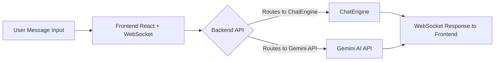
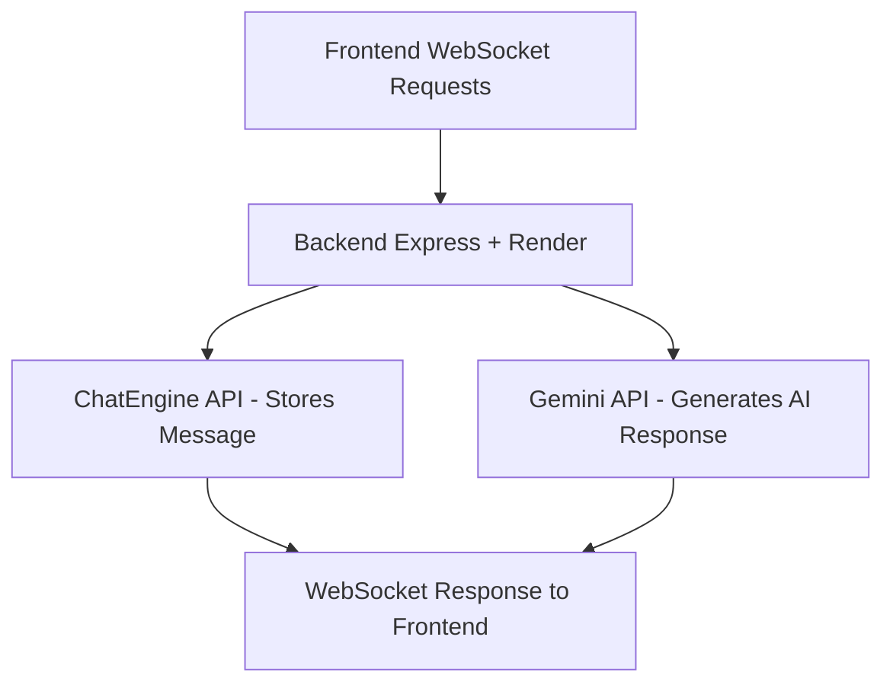

# 🌐 Trinity - Real-Time Chat Application with AI-Powered Assistance

Welcome to **Trinity**, an advanced, real-time chat application with intelligent conversation capabilities! Powered by React and Express, Trinity offers an interactive chat experience by integrating Gemini APIs for AI generation and using ChatEngine for seamless, secure user management.

## 🎉 Features
- **Real-Time Chat**: Instant communication with WebSocket technology.
- **AI-Powered Interaction**: Engage in AI-generated responses with Gemini API.
- **User Management**: Secure user storage and management with ChatEngine.
- **Responsive UI**: Built with React, tailored for any screen size.
- **Scalable Architecture**: Designed to handle growth, with separate front-end and back-end deployments.

---

## 🛠️ Tech Stack
- **Frontend**: Vite React, Vercel (deployment)
- **Backend**: Node.js, Express, Render (deployment)
- **APIs**: ChatEngine for chat management, Gemini for AI-based conversation generation
- **WebSocket**: Real-time communication support

---

## 📈 Architecture Overview

Trinity’s design balances front-end responsiveness with back-end stability to deliver a fast, reliable chat experience.

### Flowcharts

**Frontend Request Flow (React)**:
1. User interacts with the chat interface.
2. Message data is sent via WebSocket to the backend.
3. Backend forwards data as needed (ChatEngine or Gemini).
4. Real-time responses are pushed back to the front end.

**Backend Request Flow (Express + Render)**:
1. Accepts messages from frontend WebSocket requests.
2. Validates and routes data between ChatEngine (for storage) and Gemini (for AI).
3. Ensures response delivery to the appropriate user via WebSocket.

---

### Detailed Flowchart:

**Frontend Flow**:



**Backend Flow**:



---

## 🚀 Deployment Flow

1. **Frontend Deployment (Vercel)**:
   - The React app is hosted on Vercel, providing a fast, globally-distributed interface.
   - Vercel handles version control and continuous deployment with every push.

2. **Backend Deployment (Render)**:
   - The Express server is deployed on Render for efficient routing and WebSocket handling.
   - Render’s scalable environment ensures the backend can handle high message loads.
   - WebSocket server enables real-time messaging between users.

3. **API Integrations**:
   - **ChatEngine API**: Manages users and message storage.
   - **Gemini API**: Processes AI-powered responses, enhancing the chat experience with smart, interactive responses.

---

## 📐 Installation

1.Fork the Repository:

  -  Click the Fork icon at the top right of this page to create your own copy of the repository.

2.Clone the repository:

  ```bash
  https://github.com/AE-Hertz/chatapp-test.git
  ```
  -  Replace it with your username.

3.Navigate to the project folder:

  ```bash
  cd chatapp-test
  ```

4.Install dependencies for both frontend and backend:

  ```bash
  # Frontend
  cd client
  npm install

  # Backend
  cd server
  npm install
  ```

### Run Locally

To start the app locally:

```bash
# Frontend (in the frontend folder)
npm run dev

# Backend (in the backend folder)
npm nodemon
```

---

## 🛠️ Project Structure

```bash
chatapp-test/
├── client/                 # React front-end code
│   ├── public/             # Static files
│   ├── src/                # Main React components and WebSocket handling
├── server/                 # Express backend code
│   ├── routes/             # API routes (ChatEngine, Gemini)
│   ├── index.js            # Main server entry
├── README.md               # This file
```

---

## 🤖 Interactivity

With Trinity, experience the following:

1. **Smart Conversations**: Type messages and receive AI-driven responses.
2. **Instant Messaging**: ChatEngine and WebSocket keep every message in sync, in real time.
3. **Seamless User Flow**: Register, log in, and connect instantly.

---

## 🌍 Contributing

Feel free to fork this repository, submit issues, or create pull requests. We’re open to any ideas to improve Trinity!

---

## 📬 Contact

Questions, ideas, or feedback? Reach out at **Instagram** pinned in my profile :) . 

---

Enjoy chatting with **Trinity**! 🌐
